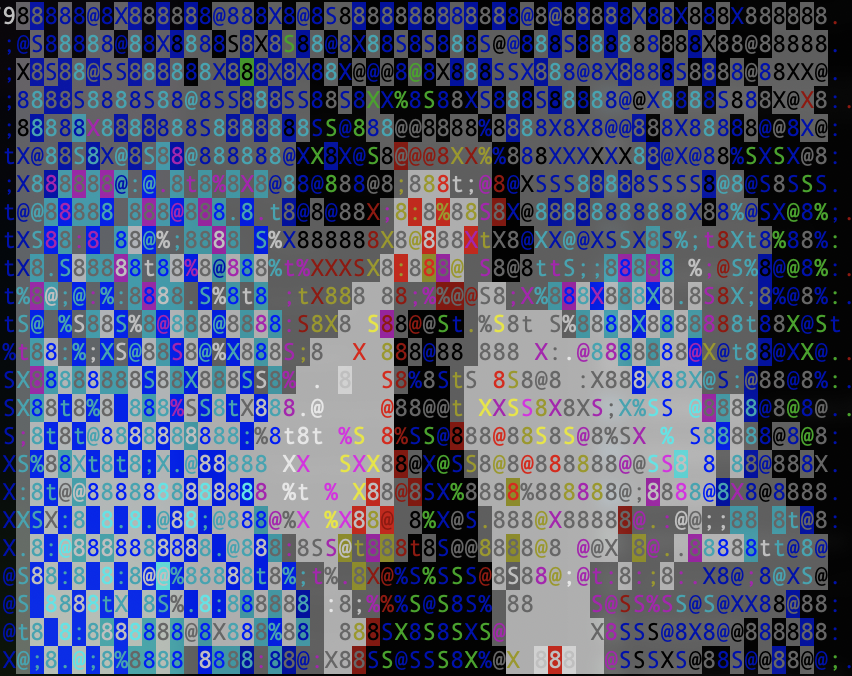

# Play videos in your terminal



I recently tried to play a video on a Raspberry Pi. I ran the command via SSH on the Pi, expecting the video to play on the device itself. But to my surprise, it started playing directly in my terminal as ASCII art. Not exactly what I was expecting—but honestly, it was even better!

I don't have my exact Raspberry Pi commands saved anymore. When I have the time and motivation, I'll figure them out again and share them here.

For now, here’s how I got it working on macOS. It even works with YouTube videos. If you run into any issues, feel free to reach out.

### macOS

#### 1. install dependencies
```
brew install yt-dlp ffmpeg libcaca
brew tap homebrew-ffmpeg/ffmpeg
brew install homebrew-ffmpeg/ffmpeg/ffmpeg --with-libcaca
```

#### 2. play video

normal resolution with audio
```
yt-dlp -o - "https://www.youtube.com/watch?v=dQw4w9WgXcQ" | tee >(mpv - --no-video > /dev/null 2>&1 &) | ffmpeg -i - -pix_fmt rgb24 -vf scale=80:24 -an -f caca -
```

low resolution with audio
```
yt-dlp -o - "https://www.youtube.com/watch?v=dQw4w9WgXcQ" | tee >(mpv - --no-video > /dev/null 2>&1 &) | ffmpeg -i - -pix_fmt rgb24 -vf scale=20:6 -an -f caca -
```

normal resolution without audio
```
yt-dlp -o - "https://www.youtube.com/watch?v=dQw4w9WgXcQ" | ffmpeg -i - -pix_fmt rgb24 -vf scale=80:24 -an -f caca -
```

low resolution without audio
```
yt-dlp -o - "https://www.youtube.com/watch?v=dQw4w9WgXcQ" | ffmpeg -i - -pix_fmt rgb24 -vf scale=20:6 -an -f caca -
```
